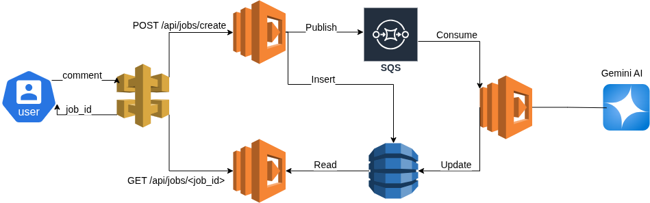

# Serverless Content Moderation API

[](https://www.python.org/downloads/release/python-311/)

A fully serverless, event-driven content moderation API built on AWS. This project uses Python, API Gateway, Lambda, SQS, and DynamoDB to provide a scalable and resilient text analysis service powered by Google Gemini.

---

## Architecture

This project is built on a decoupled, event-driven architecture that is highly scalable and resilient.

<p align="center">
  
</p>


**Workflow:**
1.  A user submits text to an **API Gateway** endpoint.
2.  A **Producer Lambda** (running a FastAPI app) generates a unique `jobId`, stores a "processing" record in **DynamoDB**, and sends a message to an **SQS queue**.
3.  The SQS message triggers a **Worker Lambda**.
4.  The Worker Lambda calls the **Google Gemini API** for content analysis.
5.  The result is used to update the record in **DynamoDB**.
6.  The user can poll a separate endpoint with the `jobId` to retrieve the results.

---

## Core Technologies

* **Python 3.11**: Core programming language.
* **AWS Lambda**: Serverless compute for both the API and the background worker.
* **Amazon API Gateway**: Exposes the Lambda functions as a public RESTful API.
* **Amazon SQS**: A message queue to decouple the API from the AI processing worker.
* **Amazon DynamoDB**: A NoSQL database for storing job status and results.
* **Google Gemini AI**: The external service used for AI-powered text classification.
* **Boto3**: The AWS SDK for Python.
* **FastAPI**: (Optional, if used) A modern, high-performance web framework for the API.

---

## Local Setup & Deployment

<!-- ### Prerequisites

* AWS Account & AWS CLI configured
* AWS SAM CLI
* Python 3.11+
* Docker (must be running)

### Setup

1.  **Clone the repository:**
    ```bash
    git clone <your-repo-url>
    cd <your-repo-name>
    ```

2.  **Store the Gemini API Key:**
    Store your Google Gemini API key in AWS Systems Manager Parameter Store as a `SecureString` with the name `/moderation-app/gemini-api-key`.

3.  **Build the application:**
    This command packages your Lambda functions and their dependencies.
    ```bash
    sam build
    ```

4.  **Deploy to AWS:**
    This command deploys all the resources (Lambda, API Gateway, SQS, DynamoDB, IAM Roles) to your AWS account.
    ```bash
    sam deploy --guided
    ```
    Follow the on-screen prompts. SAM will save your choices in a `samconfig.toml` file for future deployments.

--- -->

## API Usage

Once deployed, use the stage api.

### 1. Submit a Job

* **Endpoint**: `POST /jobs`
* **Description**: Submits a piece of text for moderation.
* **Request Body**:
    ```json
    {
      "comment": "This is a test comment to analyze for moderation."
    }
    ```
* **`curl` Example**:
    ```bash
    curl -X POST https://<api-id>[.execute-api.us-east-1.amazonaws.com/Prod/jobs](https://.execute-api.us-east-1.amazonaws.com/Prod/jobs) \
    -H "Content-Type: application/json" \
    -d '{"comment": "This is a test comment to analyze for moderation."}'
    ```
* **Success Response**:
    ```json
    {
      "job_id": "a1b2c3d4-e5f6-7890-1234-567890abcdef"
    }
    ```

### 2. Get Job Results

* **Endpoint**: `GET /jobs/{jobId}`
* **Description**: Retrieves the status and result of a moderation job.
* **`curl` Example**:
    ```bash
    curl https://<api-id>[.execute-api.us-east-1.amazonaws.com/Prod/jobs/a1b2c3d4-e5f6-7890-1234-567890abcdef](https://.execute-api.us-east-1.amazonaws.com/Prod/jobs/a1b2c3d4-e5f6-7890-1234-567890abcdef)
    ```
* **Success Response (Completed)**:
    ```json
    {
        "jobId": "a1b2c3d4-e5f6-7890-1234-567890abcdef",
        "comment": "This is a test comment...",
        "status": "completed",
        "createdAt": "2025-09-15T21:45:00Z",
        "result": {
            "decision": "allow",
            "categories": [
                {
                    "label": "sexual",
                    "code": "S",
                    "confidence": 0.1,
                    "matched_text": ""
                }
                // ... all other categories
            ]
        }
    }
    ```